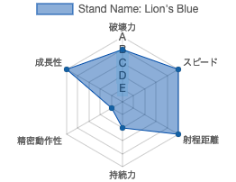

ref: https://note.com/yutabnbn/n/n345f5bd92f01

# Stand Master : Yosuke Enomoto

## 働く時間

- 8時 ~ 19時くらい
- 祝日が無い週の水曜日はお休み
    - この日は家のことをやっています
    - と言いながら、LAPRAS社での副業をしたりしている

## 場所や環境

- 基本的に自分の部屋で作業してる
- が、最近オフィスでトレーニングできるようになったので出社回数増えるかも
- 他のエンジニアと比べると、あまりガジェットなどには興味がなく安価かつシンプルな機器を使っている
- 机の上には何も無い状態にしたい派
- PC上のデスクトップやブラウザのタブもできるだけ少ない状態を保つのが好き
- とはいえ、潔癖症ということもない。(人間は埃じゃ死なない)

## コミュニケーション方法

- エンジニアっぽくないと言われることが多く、割とあっけらかんとしたコミュニケーションをとるタイプ。
- 正直すぎて言わなくても良いことまで無自覚に言ってしまうかも？
- オフラインでワイワイと騒いだりするのは好きだが、ノリを強要されるのは苦手

## MTG

- 事前にシナリオ/アジェンダをゆるくても準備した方が良いと思っている
- 参加者にはできるだけ何らかの発言をして欲しいとも思う。
- 自らの意見が必ずしも必要でないと思ったMTGには参加しないようにしている

## パフォーマンスややる気が落ちる時

- 何らかの行動を強要されていると感じた時
- 長時間労働を強いられている状態の時

## チームへの要望

- 特に情報を隠したりする意図は全くないが、伝え漏れていたりすることがあるので心配な時は質問してもらえるとありがたい
- 割と抽象度の高い話をする事が多いので、すれ違っていないか確認しながら話を進められるとGood
- フィードバックを受けて感情的になることはまずないので、お気づきの点があれば遠慮なく言ってほしい。(でも、キツイ言葉は苦手なので大人のコミュニケーションがとれると嬉しい)

## 上記レーダーチャートの意味
おまけ。

見る人が見れば分かると思いますが、「JOJOの奇妙な冒険」シリーズが大好きです。

ということで、各パラメータの解説です

| 項目    | 値 | 説明                                                                           |
| ----- | - | ---------------------------------------------------------------------------- |
| パワー   | B | 筋トレしてます。同世代よりは引き締まった体であると自負しています！将来はジェイソン・ステイサムな体になりたいので到達したらAにします           |
| スピード  | A | 業務で求められる、アウトプットを出すのは割と早い方だと思います。フィードバックを受けながら精緻化するスタイルです                     |
| 精密動作性 | E | とにかく細かい作業や定型作業は苦手。あと、初期段階から設計をめちゃくちゃ意識してコーディングするのも苦手。既存の設計方針に沿ってのコーディングは問題なし |
| 持続力   | D | 長時間労働は無理です。あと、週５連続では働けない体になってしまいました、、、                                       |
| 成長性   | A | ここは希望も込めて！与えられた役割を理解して、必要な人の知識/スキルを吸収するのは得意なので、未経験領域でもキャッチアップは早いと思います        |